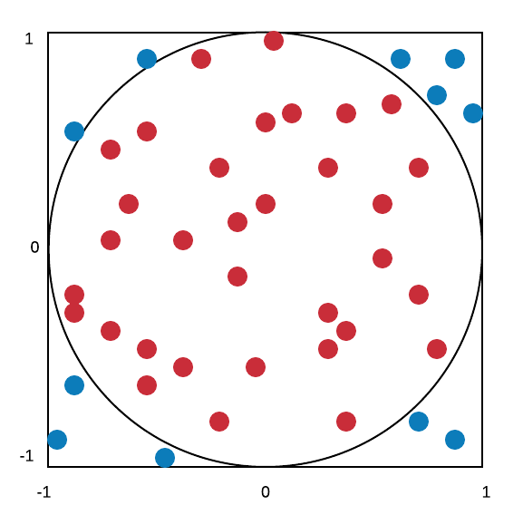

# Multiprocessing with Python

Very often a program can be split into subroutines that can be exectuded independently to each other.
In a machine with a parallel architecture, the code can take advantage of this situation by distributing each of these independent tasks to different CPUs of the system.
Nowadays, all modern computers, from laptops to High Perfomance Computers (HPCs), have a parallel architecture that can be exploited to speed up calculations.
Python offers a multitude of libraries that can be used to achieve this.
In this notes we will explore two of them:
 - the [`multiprocessing`](https://docs.python.org/3/library/multiprocessing.html#module-multiprocessing) library (from the Pyhton standard library)
 - the [`mpi4py`](https://mpi4py.readthedocs.io/en/stable/) library (available with pip)

## `multiprocessing`

The `multiprocessing` library is a useful parallelization library for machines with a [**shared memory**](https://en.wikipedia.org/wiki/Shared_memory) architecture.  
A *laptop* or a *single node* in a HPC machine are examples of shared memory machines.
This means that the `multiprocessing` is [not suitable](https://stackoverflow.com/questions/5181949/using-the-multiprocessing-module-for-cluster-computing) to distribute a parallel calculation over a cluster, where each machine/node don't share the same memory (in the case of distributed memory systems we must look into `mpi`, see the next section).

`multiprocessing` is part of the standard python library. On this tutorial we will show how to use the [`Pool`](https://docs.python.org/3/library/multiprocessing.html#using-a-pool-of-workers) class:
this class allows to create a pool of workers (i.e. processes) and provides several methods to distribute tasks to the workers.

Let's write an example: we want to calculate $\pi$ by counting how many random numbers fall inside a unit circle.



The value of $\pi$ is then
```math
\pi \sim 4 \times \frac{\text{hits}}{\text{total}}
```

```python
import multiprocessing as mp
```


## `mpi4py`


install openmpi

rename the folder `compiler_compat` to some `compiler_compat_bak`

so to avoid the linker error 

run pip install mpi4py

